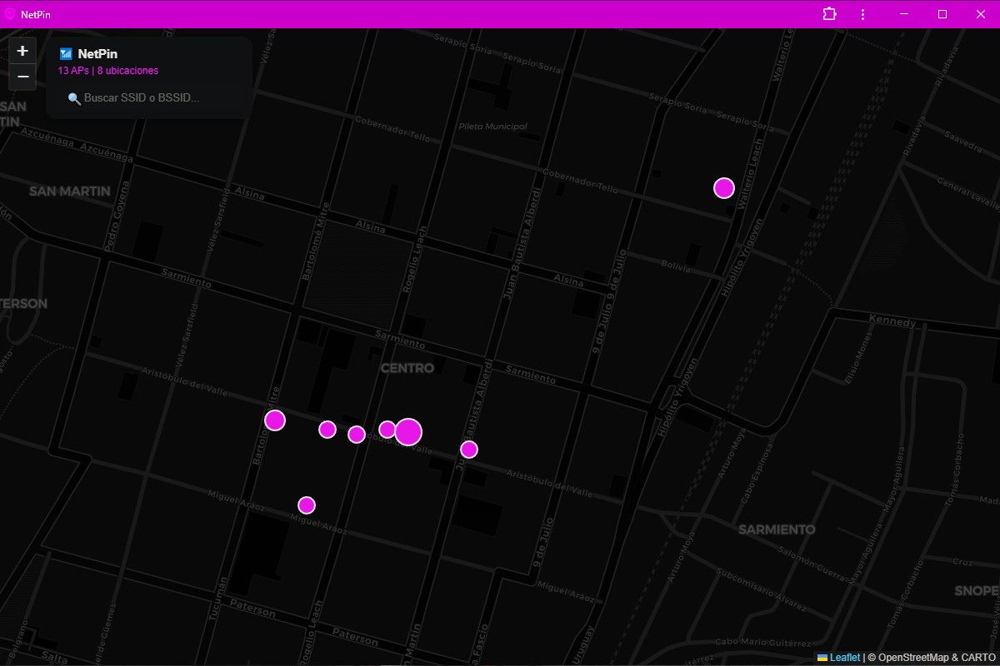
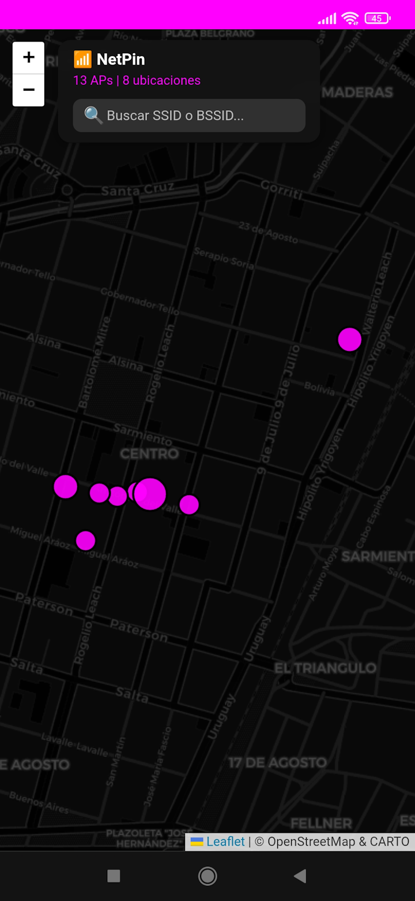
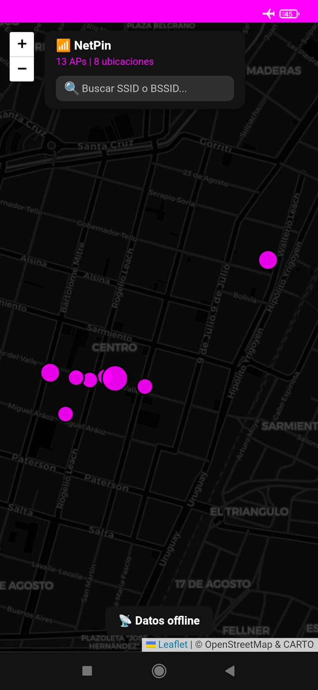

# NetPin

> **A lightweight Offline-First Wi-Fi mapping PWA built with Vanilla JavaScript.**

NetPin is a Progressive Web App (PWA) for visualizing Wi-Fi Access Points (APs) on an interactive map.

It retrieves data directly from a public Google Sheets document, groups APs sharing the same physical location, and provides a complete offline experience by automatically downloading map tiles during installation.

Designed with simplicity in mind, NetPin is built entirely with open web technologies—no backend, no frameworks, and no external dependencies beyond Leaflet and OpenStreetMap.

---

## Live Demo

Try NetPin directly from GitHub Pages:

https://hardrive9000.github.io/NetPin/

> For the complete offline experience, install the PWA from your browser.

---

## Screenshots

### Desktop PWA


### Mobile PWA


### Offline Mode (Mobile PWA)


---

## Coverage

NetPin currently covers only:

📍 San Pedro, Jujuy, Argentina

The application itself can be installed anywhere, but the Wi-Fi database and offline map are currently limited to this area.

---

## Features

* Progressive Web App (PWA)
* Offline-first architecture
* Automatic offline map download during installation
* Interactive map powered by Leaflet
* CARTO Dark Matter map style
* Google Sheets as a live data source
* Automatic GeoJSON generation in memory
* Smart grouping of APs sharing identical coordinates
* Dynamic marker sizing based on AP count
* Real-time search by SSID or BSSID
* Responsive design for desktop and mobile devices
* Fully client-side
* No backend required
* Vanilla JavaScript

---

## Offline Mode

When NetPin is installed as a PWA, it automatically downloads all required map tiles for offline use.

Current offline coverage:

* Zoom levels: **14–18**
* Cached tiles: **7.222**
* Offline cache size: **~7 MB**

Once downloaded, the map remains fully functional even without an Internet connection.

---

## Data Source

NetPin retrieves Wi-Fi information directly from a public Google Sheets spreadsheet.

Expected columns:

| Column    | Description                     |
| --------- | --------------------------------|
| ID        | Unique identifier               |
| SSID      | Wi-Fi network name              |
| BSSID     | Access Point MAC address        |
| Password  | Wi-Fi password                  |
| Signal    | Access Point strength signal    |
| Notes     | Misc details about Access Point |
| Longitude | Longitude coordinate            |
| Latitude  | Latitude coordinate             |

Example:

| ID | SSID   | BSSID             | Password  | Signal |   Notes   | Longitude  | Latitude   |
| -- | ------ | ----------------- | --------- | ------ | --------- | ---------- | ---------- |
| 1  | MyWiFi | AA:BB:CC:DD:EE:FF | secret123 | nn db  | public AP | -64.867495 | -24.233452 |

---

## Technologies

* HTML5
* CSS3
* Vanilla JavaScript (ES6+)
* Leaflet
* OpenStreetMap
* CARTO Dark Matter
* Google Sheets Visualization API
* Progressive Web App (PWA)
* Service Worker
* Cache Storage API
* Web App Manifest

---

## Project Structure

```text
netpin/
│
├── assets/
│   ├── css/
│   │   └── styles.css
│   │
│   ├── img/
│   │   └── favicon/
│   │
│   └── js/
│       └── app.js
│
├── docs/
│   └── img/
│
├── index.html
├── manifest.json
├── sw.js
├── LICENSE
└── README.md
```

---

## How It Works

1. Retrieve Wi-Fi data from Google Sheets.
2. Convert spreadsheet rows into GeoJSON features.
3. Group APs sharing identical coordinates.
4. Render interactive markers using Leaflet.
5. Allow real-time filtering by SSID or BSSID.
6. Download offline map tiles during PWA installation.
7. Serve cached tiles transparently when offline.

---

## Design Goals

NetPin follows a few simple engineering principles:

* Keep it lightweight.
* Work offline whenever possible.
* No backend.
* No frameworks.
* Keep the code readable and maintainable.

---

## Performance

Current implementation:

* ~7 MB offline cache
* 7.222 cached map tiles
* Offline-first operation
* Lightweight client-side architecture
* No server-side processing

Typical Lighthouse scores:

* Performance: **95**
* Accessibility: **98**
* Best Practices: **100**
* SEO: **91**

---

## Roadmap

Planned improvements:

* RSSI visualization
* Heatmap mode
* GeoJSON import/export
* Additional filtering options

---

## License

This project is released under **The Unlicense**.

---

## Author

Created as a personal Wi-Fi mapping project to explore what can be achieved using modern web standards while keeping the application lightweight, maintainable, and completely client-side.

---

<sub><i>Gsz czbzk Wsyxye, egg raqts, jww rabtnz lns pp rlfjbey.</i></sub>
